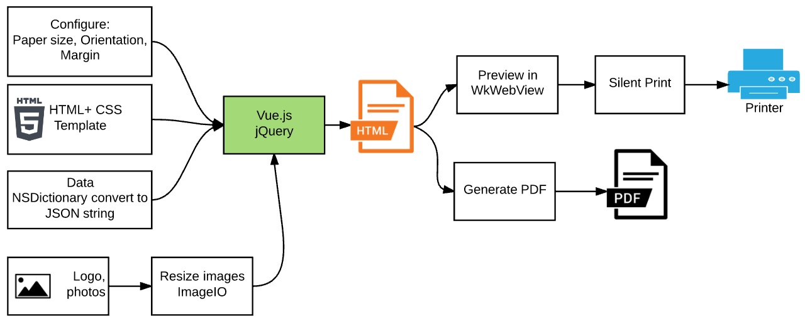

# How use PDF Generation library

## Introduction
PDF Generator library depends on two Apple Libraries and Vue.js library
1. Vue.js: Javascript library that is intuitive, Fast and Composable MVVM for building interactive interfaces
2. WebKit: display web page
3. ImageIO: scale image resolution. It is used to scale down large images before export to PDF file



**Source codes of PDF Generator**
- PaperConfig.h 
- PaperConfig.m     //configure page size, orientation, margin
- PDFGenerator.h
- PDFGenerator.m    //Generate PDF from WkWebView content
- PDFPageRenderer.h
- PDFPageRenderer.m //Format to render PDF
- UIImage+Utils.h
- UIImage+Utils.m   //resize image then save to temporary folder
- LENSReportKey.h   //define place holder fields in report

We can add more reports as we wish. This PDF Generator is totally decoupled from main application.

**Key functions in PDF Generator**
```objective-c
typedef void (^onGenerateComplete)(NSString* _Nullable result, NSError*  _Nullable error);

@interface PDFGenerator : NSObject

-(void)generatePDF: (NSString* _Nonnull) fileOutput
         ofWebView: (WKWebView* _Nonnull) webView
   withPaperConfig: (PaperConfig* _Nonnull) paperConfig
        onComplete: (onGenerateComplete _Nonnull) complete;
@end
```

Parameters explanation:
- fileOutput: full file path of generated PDF file
- webView: web view content of document need to convert to PDF
- paperConfig: set configuration for file
- complete is call back function 
```objective-c
typedef void (^onGenerateComplete)(NSString* _Nullable result, NSError*  _Nullable error);
```

Example code:
```objective-c
- (void) savePDF {
    NSString* pdfFile = [NSString stringWithFormat:@"%@tmp.pdf", NSTemporaryDirectory()];
    [self.generator generatePDF: pdfFile
                      ofWebView: self.webView
                withPaperConfig: self.paperConfig
                     onComplete:^(NSString *result, NSError *error) {
                         if (error) {
                             NSLog(@"%@", error);
                         } else {
                             dispatch_async(dispatch_get_main_queue(), ^{
                                 [self informPDFSaveSuccess: pdfFile];
                             });
                         }
                     }];
}
```