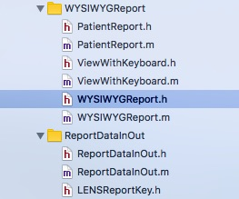

# How to create a nice web report using Vue.js

## What make a good report in mobile app?
1. It should not tightly couple with native code
2. It is highly customizable, download the Internet then render in app
3. It can be modified inside or outside app by simple method

## Why I choosed HTML, CSS, Javascript render report in WKWebView?
1. It is easy to code, preview and debug
2. It can be responsive
3. It can interact with user: update text field, select new photo...
4. WKWebView can invoke native method in app. From app, we can invoke JavaScript method. Pass data back and forward is easy.

I call it WYSIWYG report because user can change data when viewing report

## Why I choose Vue.js over React or Angular?
1. Vue.js is easy to learn, quick to develop MVVM report
2. Vue.js supports template syntax like Mustache

Look at followings files


WYSIWYG report requires 3 
1. Vue.js: already mentioned above.
2. WebKit that contains WKWebView to render web page
3. ImageIO: scale image resolution. It is used to scale down large images before export to PDF file
## important files

Report view controller must inherit from class WYSIWYGReport
WYSIWYGReport.h
```objective-c
@interface WYSIWYGReport : UIViewController <UINavigationControllerDelegate, WKScriptMessageHandler, UIImagePickerControllerDelegate, CustomKeyboardDelegate>

@property (nonatomic, readonly) NSString* _Nonnull reportTemplate;
@property (nonatomic, strong) WKWebView* _Nonnull webView;

-(id _Nonnull ) initWithReportTemplate: (NSString*_Nonnull)  report;
-(void) applyJSONDataToReport: (NSString*_Nonnull) json
            completionHandler: (void (^ _Nullable)(_Nullable id, NSError * _Nullable error))completionHandler;
@end
```


Sample initialization
```objective-c
@implementation PatientReport
- (id) init {
    return [super initWithReportTemplate:@"patient_report"];
}
```

## How to pass data into report
Look at file [ReportDataInOut/ReportDataInOut.m](https://github.com/TechMaster/SampleSilentPrint/blob/master/SilentPrintDemo/ReportDataInOut/ReportDataInOut.m)

The app applies data to report by passing JSON string to JavaScript method setData in [report_mixin.js](https://github.com/TechMaster/SampleSilentPrint/blob/master/SilentPrintDemo/Report/report_mixin.js)

```objective-c
-(void) applyJSONDataToReport: (NSString*) json
            completionHandler: (void (^ _Nullable)(_Nullable id, NSError * _Nullable error))completionHandler
{
    [self.webView evaluateJavaScript: [NSString stringWithFormat: @"setData(%@);", json]
                   completionHandler: completionHandler];
}
```
A HTML - Vue.js web report [looks like](https://github.com/TechMaster/SampleSilentPrint/blob/master/SilentPrintDemo/Report/patient_report_inout.html)
it refers to:
- [report_data.js](https://github.com/TechMaster/SampleSilentPrint/blob/master/SilentPrintDemo/Report/report_data.js) prepare sample data for report
- [report_mixin.js](https://github.com/TechMaster/SampleSilentPrint/blob/master/SilentPrintDemo/Report/report_mixin.js) collections of handy function to render web report
- [layout_photo.js](https://github.com/TechMaster/SampleSilentPrint/blob/master/SilentPrintDemo/Report/layout_photo.js) layout selected photos in report depends on two parameters: total number of photos and number of photos in one page.
